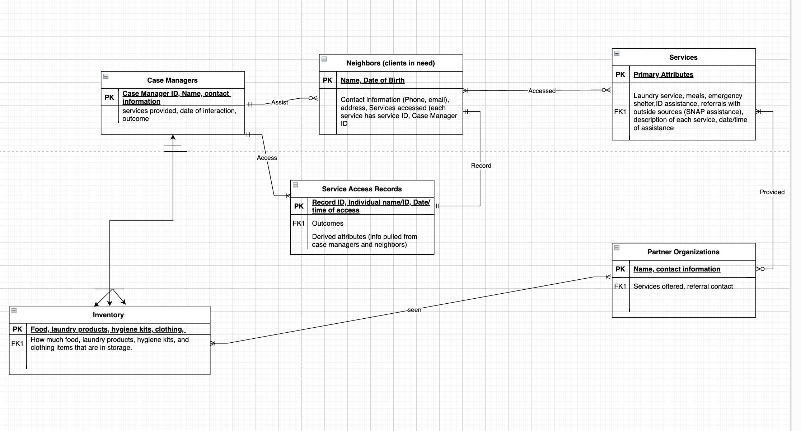

# project-milestones
For working with each project milestone 

# Milestone 1: Creating A Data Model
**Learning Objective:** Setup your teams, decide roles, and practice Git while you're at it

## List and description of data sources 

UP data: Since UP is a local, small non-profit, the only data they want to use is directly related to their operational process. Thus, the list of data is:
	Neighbors: each individual who needs assistance from the organization. As part of its policies, UP only registers them on their second visit. This registration includes name, 
	Partners: what is the partner and what service do they provide.
	Inventory: the organization is almost completely privately funded on the basis of donations, and the different forms of products they receive are registered on paper.

## Business Rules (both data and non-data) 

A NEIGHBOR is registered by a VOLUNTEER on the VISIT RECORD only once on their second visit to UP, whereas the RECORD registers optional one NEIGHBOR by at least one VOLUNTEER.

A NEIGHBOR can receive one VISIT SERVICE registration per action registered many times on the VISIT RECORD, and a VISIT SERVICE can be received by optional one NEIGHBOR registred optionally on the VISIT RECORD. 

A NEIGHBOR follows guidelines on the usage of INVENTORY items. The NEIGHBOR can acquire optional many items from the INVENTORY, whereas the INVENTORY may have a NEIGHBOR acquiring items optionally many times. 

An VOLUNTEER has access to many VISIT RECORD data, whereas the VISIT RECORD can be accessed by many VOLUNTEERS with access.

Using the VISIT SERVICE, a VOLUNTEER can start a process to assist the NEIGHBOR in receiving many VISIT SERVICE. 

A VISIT SERVICE is provided by optional one PARTNER ORGANIZATION, whereas a PARTNER ORGANIZATION can provide at least one SERVICE. The SERVICE is then tracked on the NEIGHBOR’s record and followed up as necessary by at least one UP ADMINISTRATOR. 

## Entity Names and Definitions

Neighbors: a houseless person who seeks UP for support. They can be classified as emergency housed (e.g. a person sleeps in someone’s house), underhoused (they may have a shelter, but it is not optimal. e.g. a shed or trailer without access to electricity or water, or similar precarious situations).
Attributes: NeighborID, FirstName, LastName, Date of Birth, Contact Information (phone, email), Mailing Address, Services Accessed (list of service IDs), HasStateId, HasPet.

Visit Services: the relationship between partner organization, UP, and the neighbor registered on Visit Record
Attributes: ServiceOrder, PartnerName, NeighborId, VolunteerId, DateService, Description.

Service Records: history of services provided throughout the work. 
Attributes: RecordID, ServiceOrder, Date, Time.

Partner Organizations: organization that assist UP on their mission.
Attributes: PartnerName, ServiceType, ContactPerson, Email, Phone, DateofStart.

Inventory: the organization has an inventory of clothing, hygiene kits, and food, and there are some guidelines about how many items can a neighbor have. These guidelines are always changing on a case-by-case basis. UP also envisions this process being automatize and displayed on their website so donors can see what the organization needs the most.
Attributes: NameOfItemItem, VolunteerID, ExpirationDate, NumerofItem

## Relationships

Individuals to Services

Many-to-Many: An individual can access multiple services, and a service can be accessed by multiple individuals. This relationship is mediated by the Service Access Records entity.

Individuals to Case Management

One-to-Many: A single case manager can assist multiple individuals, but an individual's case is primarily managed by one case manager at a time.
Case Management can Access many records but records can only be accessed by one Case Manager.

Services to Partner Organizations

Many-to-Many: A service may be provided in partnership with multiple organizations, and an organization can offer multiple services. This might be more indirect, depending on how closely services are tied to specific partners.
Partner Organizations can see many inventory and inventory can be seen by many Partner organizations.

Individuals to Document Assistance Records

One-to-Many: An individual can have multiple document assistance records (for different documents or repeated assistance).

Inventory to Case Managers
Inventory can be modified by many Case managers, Inventory needs a Case Manager to be modified.

## **Entity Relationship Diagram (ERD)**: 

# Milestone 2: Project Schema Design
**Learning Objective:** 
Translating conceptual ER diagrams into relational schemas.
Representing real-world organizational data as a relational data model
Observe how conceptual design decisions translate into the logical design stage

## Reflection:

We discussed how the ERD model really helped us visualize the logic behind each relationship and entity. The visual aid was very useful to us. Using the ERD tools that were available to us, we were able to easily make changes, which was extremely important as we kept adjusting the logic behind our process.
We would have been more specific with our attributes to prevent confusion. We also would have spent more time planning what would be Primary and Foreign Keys!

## Changes from the ERD model: 
In order to reorganize our model, we created two one new associative entity called Visit Service. Our information now is restructured in a way that the neighbor will be registered on the Visit Record through the Visit Service entity. 

## Schema

